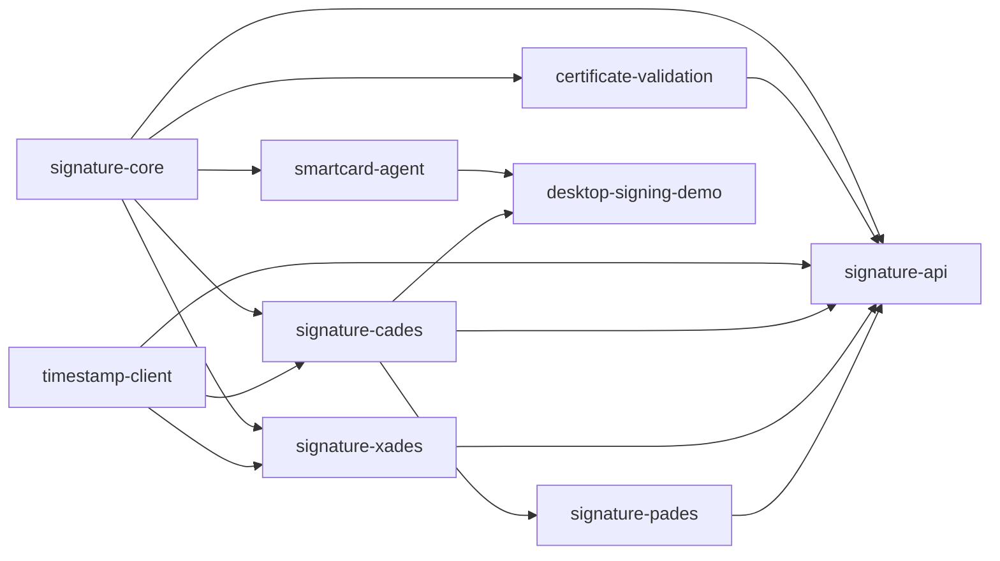

# Yapay Zekâ ve Geliştirici Devir Teslim Rehberi

> Son güncelleme: 18 Ağustos 2026  
> Güncel yazılım durumu: Faz 1–11 kod teslimleri mevcut; üretim kabul kapıları açık  
> Ayrıntılı durum: [PROJECT_STATUS.md](PROJECT_STATUS.md)  
> Çalışma kuralları: [AGENTS.md](AGENTS.md)

Bu belge projeyi ilk kez açan bir geliştiricinin veya yapay zekâ asistanının, eski sohbet
kayıtlarına ihtiyaç duymadan güvenli biçimde geliştirmeye başlaması için hazırlanmıştır.

## 1. Projenin amacı

Proje, Türkiye'deki elektronik imza kullanım senaryoları için Java 21 tabanlı bir imzalama
ve doğrulama altyapısıdır. Üç kullanım yüzeyi vardır:

1. `signature-api`: Merkezi REST API, yönetim ve web demo ekranları.
2. `smartcard-agent`: Son kullanıcının bilgisayarında, yalnız loopback üzerinden çalışan
   client-side akıllı kart uygulaması. PIN Swing penceresinde alınır.
3. `desktop-signing-demo`: Merkezi API olmadan JAR kütüphanelerini kullanan offline Swing
   CAdES imzalama/doğrulama örneği.

Kütüphaneler REST olmadan da kullanılabilir. Doğrudan kullanım örnekleri
`JAVA_KUTUPHANE_ENTEGRASYONU.md` içindedir.

## 2. İlk okunacak dosyalar

| Sıra | Dosya | Neden |
|---|---|---|
| 1 | `AGENTS.md` | Güvenlik, mimari ve test kuralları |
| 2 | `PROJECT_STATUS.md` | Gerçeklenenler, kanıtlar ve açık işler |
| 3 | `README.md` | Derleme, çalıştırma ve kullanıcı yüzeyleri |
| 4 | `E_IMZA_PROJE_PLANI.md` | Kronolojik karar kayıtları |
| 5 | İlgili `FAZ_*.md` | Özelliğin ayrıntılı tasarımı ve kabul ölçütleri |
| 6 | `STANDART_DEGISIKLIGI_ETKI_HARITASI.md` | Standart değişikliğinde kod/test rotası |
| 7 | OpenAPI YAML'ları | REST ve agent sözleşmesinin makinece okunur hali |

Faz belgeleri kronolojiktir. Örneğin Faz 7'de XAdES/PAdES “sonraki faz” olarak yazabilir;
bu özellikler Faz 10'da gerçekleştirilmiştir. Güncel gerçek için `PROJECT_STATUS.md` ve kod
esas alınır.

## 3. Modül bağımlılıkları



| Modül | Ana giriş noktaları |
|---|---|
| `signature-core` | Format/seviye/paketleme/mod modelleri, oturum durum makinesi |
| `certificate-validation` | `DefaultCertificateValidator`, CRL/OCSP sağlayıcıları |
| `timestamp-client` | RFC 3161 istemcisi ve cevap doğrulaması |
| `signature-cades` | `CadesSignatureService`, verifier/inspector, `CadesLongTermService` |
| `signature-xades` | `XadesSignatureService`, `XadesSignatureVerifier` |
| `signature-pades` | `PadesSignatureService`, `PadesSignatureVerifier` |
| `smartcard-agent` | `Pkcs11TokenService`, `CardAgentService`, loopback controller |
| `desktop-signing-demo` | Offline Swing uygulaması ve yerel profil deposu |
| `signature-api` | Oturum orkestrasyonu, validation, trust store, TSA ve server key yönetimi |

## 4. İmzalama desenleri

### 4.1 Doğrudan JAR

Her format aynı dış anahtar desenini izler:

```text
belge/özet + sertifika
        │
        ▼
formatService.prepare(...)
        │ digestToSign / signedAttributes / signedInfo
        ▼
uygulamanın PrivateKey, kart veya HSM adaptörü
        │ raw signature
        ▼
formatService.completeBaseline(...) veya completeWithTimestamp(...)
        │
        ▼
.p7s / .xades.xml / .signed.pdf
```

Format modülü özel anahtarı görmez. PKCS#11 imzasında `digestToSign` kullanılır; testteki
yazılım anahtarı örneklerinde hazırlanmış `signedAttributes`/`signedInfo` JCA ile imzalanır.

### 4.2 Server-side

1. Yönetici `/admin/` üzerinden server key profili tanımlar.
2. SMART_CARD: ATR + mutlak PKCS#11 yolu, otomatik slot keşfi.
3. HSM: mutlak PKCS#11 yolu + sabit slot + `credentialRef`; ATR yok.
4. İş uygulaması `/api/v1/signing-sessions` isteğinde yalnız `serverKeyId` gönderir.
5. `/server-sign` yeni imzayı üretir. HSM secret değeri HTTP isteğinden alınmaz.
6. SMART_CARD için `/server-sign` PIN alanı opsiyoneldir. PIN varsa yalnız işlem
   süresince kopyalanır ve temizlenir; yoksa profil `credentialRef` değeri veya
   PIN gerektirmeyen/mevcut token oturumu denenir.
7. Kart middleware'i giriş isterse `SERVER_SMART_CARD_LOGIN_REQUIRED` döner;
   istek daha PKCS#11 çağrılmadan genel bir PIN zorunluluğuyla reddedilmez.
8. HSM istek PIN'ini kabul etmez ve zorunlu güvenli `credentialRef` çözümlemesini
   kullanmaya devam eder.

### 4.3 Client-side

1. Agent `127.0.0.1:18443` üzerinde başlar.
2. Agent cihaz kimliği merkezde tenant kapsamına kaydedilir.
3. Tarayıcı public kart sertifikalarını listeler; PIN istemez.
4. Merkez imzalı manifest üretir.
5. Agent manifesti doğrular, kullanıcıya içeriği gösterir ve PIN'i Swing penceresinde alır.
6. Ham imza ve cihaz imzası merkeze döner; merkez artifact'i tamamlar.

Client-side isteğe HSM, PKCS#11 kütüphane yolu veya slot eklenmemelidir.

## 5. Format ve çoklu imza matrisi

| Format | Tek imza | Paralel | Seri | Uzun dönem |
|---|---|---|---|---|
| CAdES | ATTACHED/DETACHED B-B/B-T | Üst seviye `SignerInfo` | CMS `counterSignature` | B-LT/B-LTA ve yenileme |
| XAdES | DETACHED/ENVELOPED/ENVELOPING B-B/B-T | DETACHED/ENVELOPING | `xades:CounterSignature` | B-LT/B-LTA henüz yok |
| PAdES | ENVELOPED B-B/B-T | Yok | Incremental PDF revision | B-LT/B-LTA henüz yok |

API alanları:

- `multiSignatureType`: `SINGLE`, `PARALLEL`, `SERIAL`
- `existingArtifactBase64`: ek imzada önceki artifact
- `targetSignatureIndex`: CAdES/XAdES seri imzada sıfır tabanlı hedef; PAdES'te 0

## 6. Kalıcı veri ve yapılandırma

- `signature-api` Spring Data JPA ve Flyway kullanır.
- Güncel migration: `V12__add_multi_signature_sessions.sql`.
- Mevcut migration değiştirilmez; yeni sürüm eklenir.
- Local profil `.eimza/local-db` dosya tabanlı H2, üretim PostgreSQL kullanır.
- Güven deposu kök/alt kök CA kayıtlarını immutable snapshot sürümleriyle yönetir.
- TSA ve doğrulama politikaları sürümlüdür.
- Oturum belge/artifact alanları işlem sırasında DB'de bulunabilir; üretim saklama ve kişisel
  veri süresi kurum/KVKK kararıyla kesinleştirilmelidir.

## 7. Uygulama ve belge yüzeyleri

| Yüzey | Adres/dosya |
|---|---|
| İlk imza demosu | `http://localhost:8080/demo/` |
| Çoklu imza demosu | `http://localhost:8080/multi-signature/` |
| Doğrulama | `http://localhost:8080/validation/` |
| Yönetim | `http://localhost:8080/admin/` |
| API OpenAPI | `signature-api/.../openapi/e-signature-api-v1.yaml` |
| Agent OpenAPI | `smartcard-agent/.../openapi/smartcard-agent-v1.yaml` |
| PDF entegrasyon kılavuzu | `output/pdf/E_Imza_API_Entegrasyon_Kilavuzu.pdf` |

## 8. Yerel geliştirme

### 8.1 Tüm testler

```powershell
mvn "-Dmaven.repo.local=D:\ErbayProject\.m2\repository" clean verify
```

### 8.2 API

```powershell
mvn "-Dmaven.repo.local=D:\ErbayProject\.m2\repository" `
  -pl signature-api -am "-DskipTests" package
java -jar .\signature-api\target\signature-api-0.1.0-SNAPSHOT-exec.jar `
  --spring.profiles.active=local
```

### 8.3 Agent

```powershell
Copy-Item .\agent-local.example.yml .\agent-local.yml
.\scripts\start-local-agent.ps1
```

Makineye özel `agent-local.yml` Git'e eklenmez. AKİS profili için bilinen ATR
`3B9F978131FE4580655443D3228231C073F621808105D3`; slot otomatik bulunur.

### 8.4 Offline masaüstü

```powershell
java -jar .\desktop-signing-demo\target\desktop-signing-demo-0.1.0-SNAPSHOT-exec.jar
```

## 9. Değişiklik yaparken izlenecek yol

1. `PROJECT_STATUS.md` içindeki mevcut davranışı ve açığı belirle.
2. İlgili faz belgesindeki güvenlik/standart kararlarını oku.
3. Public API ve DB etkisini çıkar; gerekiyorsa OpenAPI ve yeni migration tasarla.
4. Format çekirdeğini API/UI'dan önce değiştir.
5. Pozitif ve negatif otomatik test ekle.
6. Server/client/direct-JAR tüketicilerinin geriye uyumluluğunu denetle.
7. İlgili Markdown dosyalarını ve `CHANGELOG.md` dosyasını aynı değişiklikte güncelle.
8. Hedef testleri, sonra reactor testini çalıştır.
9. Fiziksel cihaz/canlı servis gerektiren sonucu otomatik test sonucuymuş gibi işaretleme.

## 10. Bilinen tuzaklar

- Varsayılan Spring profili `prod` olduğundan yerelde `--spring.profiles.active=local`
  açıkça yazılmalıdır.
- Kök projede `-am spring-boot:run` kullanmak parent POM'da main class hatası üretir.
- Çalıştırmak için `*-exec.jar`, kütüphane bağımlılığı için normal JAR kullanılır.
- Süresi dolmuş test kartında tarih politikası yalnız local/test için pasifleştirilebilir.
- `XAdES ENVELOPED + PARALLEL` önceki digest'i bozacağı için desteklenmez.
- PAdES seri imza mevcut imzalı PDF'yi kaynak alır; önceki revision yeniden yazılmaz.
- Çoklu istekte iki Base64 alanı bulunabileceğinden gövde sınırı varsayılan 70 MiB'dir ve
  `EIMZA_MAXIMUM_REQUEST_BYTES` ile ortam bazında ayarlanır.
- Doğrulama raporunda `INDETERMINATE`, otomatik olarak geçerli anlamına gelmez.

## 11. Projenin kaldığı yer

Kod seviyesinde Faz 11 bitmiştir. Sonraki ana iş yazılım özelliği eklemekten çok, Faz 12'de
tanımlanan üretim kabul ve birlikte çalışabilirlik kanıtlarını toplamaktır. XAdES/PAdES
B-LT/B-LTA istenirse bu ayrıca yeni bir geliştirme fazı olarak ele alınmalıdır.

Devam etmeden önce [FAZ_12_URETIM_KABUL_VE_BIRLIKTE_CALISABILIRLIK.md](FAZ_12_URETIM_KABUL_VE_BIRLIKTE_CALISABILIRLIK.md)
ve [REPOSITORY_READINESS.md](REPOSITORY_READINESS.md) okunmalıdır.
