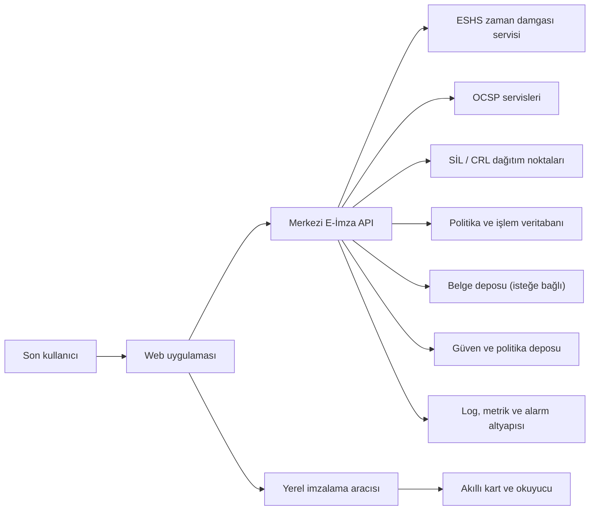
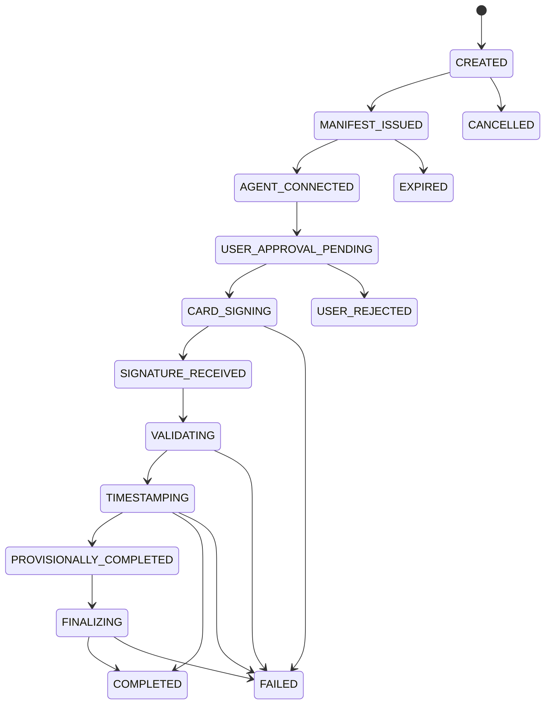
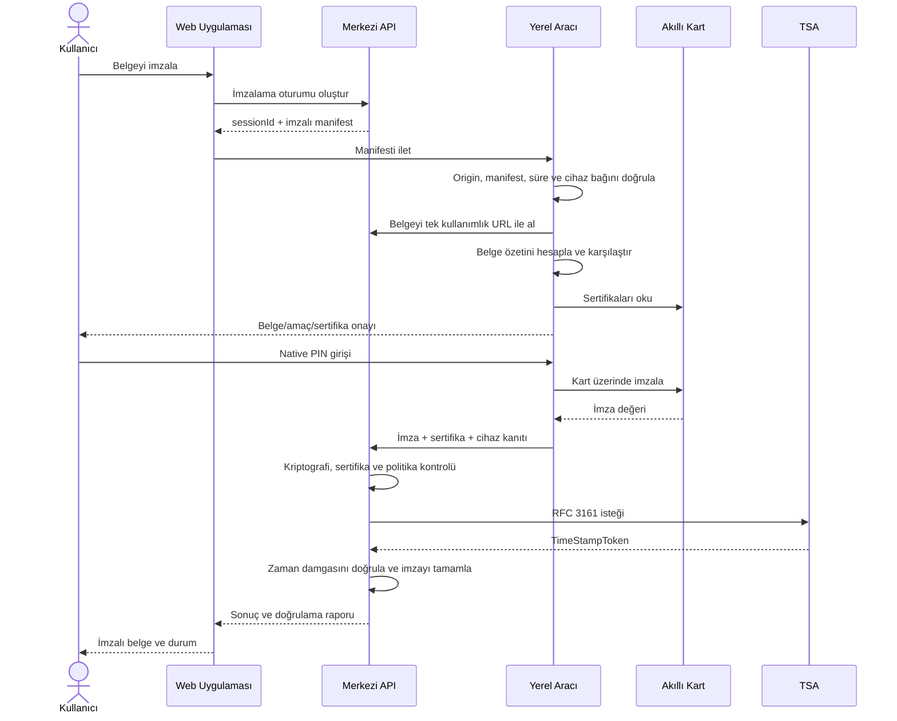
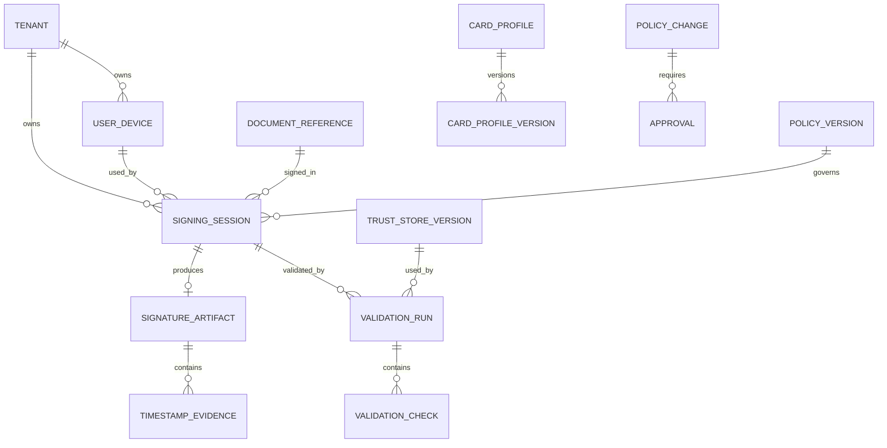
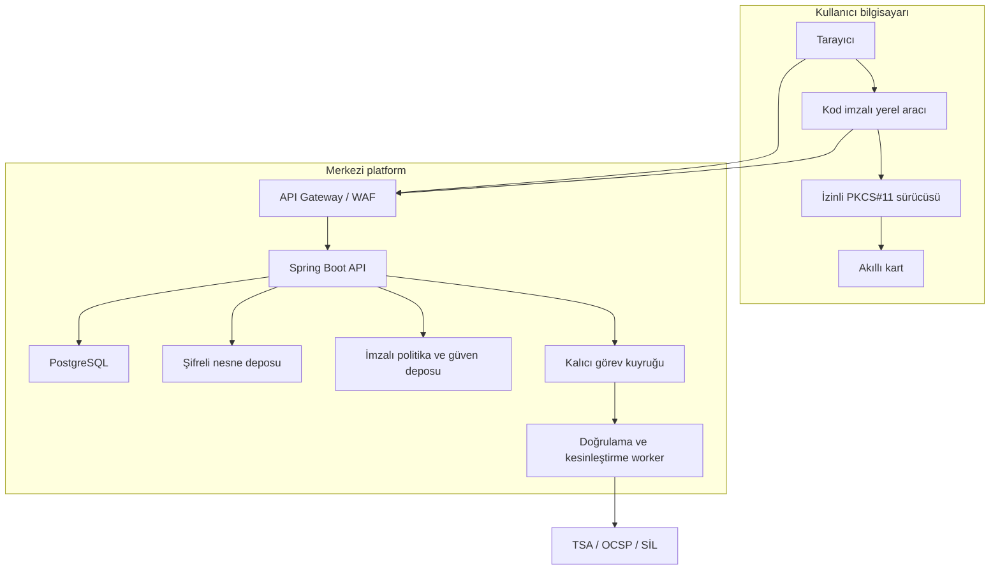

# Faz 2 — Mimari Tasarım ve Güvenlik Tehdit Modeli

> Güncel gerçekleşme ve açık kabul durumu için [PROJECT_STATUS.md](PROJECT_STATUS.md) esas alınır.

> Durum: Mimari temel tamamlandı; ürün, hukuk ve güvenlik onayı bekliyor  
> Belge sürümü: 1.0  
> Tarih: 28 Temmuz 2026  
> Bağlı belgeler: [Proje Planı](E_IMZA_PROJE_PLANI.md), [Faz 1 Uyumluluk Matrisi](FAZ_1_UYUMLULUK_MATRISI.md)

## 1. Amaç

Bu belge E-İmza API sisteminin:

- Bileşenlerini ve aralarındaki güven sınırlarını,
- Merkezi API ile yerel akıllı kart aracısının sorumluluklarını,
- İmzalama ve doğrulama akışlarını,
- Kimlik doğrulama ve yetkilendirme modelini,
- Tehdit modelini ve güvenlik kontrollerini,
- İlk REST API sözleşmesini,
- İşlem durumlarını, hata modelini ve veri modelini

tanımlar.

Bu fazda uygulama kodu yazılmaz. Buradaki kararlar Faz 3 proje iskeleti ve OpenAPI sözleşmesinin girdisidir.

## 2. Mimari varsayımlar

1. İmzalama işlemi bir web uygulamasından başlatılacaktır.
2. Akıllı kart, son kullanıcının bilgisayarına bağlıdır.
3. Merkezi API karta ve PIN'e doğrudan erişmez.
4. Kullanıcının bilgisayarında imzalı bir yerel aracı çalışır.
5. Özel anahtar akıllı karttan hiçbir zaman dışarı çıkmaz.
6. Yerel aracı yalnız açıkça eşleştirilen merkezi ortamlardan istek kabul eder.
7. Doğrulama, sertifika zinciri, iptal kontrolü, zaman damgası ve politika değerlendirmesi merkezi API'de yapılır.
8. Belge içeriğinin sunucuda saklanıp saklanmayacağı henüz kesinleşmemiştir; mimari iki seçeneği de destekler.
9. İlk dağıtım tek kurum/tenant olabilir; veri modeli ileride çoklu tenant kullanımına kapıyı kapatmaz.

## 3. Sistem bağlamı



### 3.1 Güven sınırları

| Sınır | İç taraf | Dış taraf | Başlıca risk |
|---|---|---|---|
| G-01 | Merkezi API | Web istemcisi | Kimlik taklidi, yetki aşımı, istek değiştirme |
| G-02 | Yerel aracı | Tarayıcı/web uygulaması | Kötü amaçlı site, CSRF, DNS rebinding, localhost kötüye kullanımı |
| G-03 | Yerel aracı | PKCS#11 sürücüsü/kart | Kötü amaçlı DLL, yanlış kart, PIN denemesi, sürücü çökmesi |
| G-04 | Merkezi API | TSA/OCSP/SİL uçları | Sahte yanıt, SSRF, gecikme, servis kesintisi |
| G-05 | Merkezi API | Veritabanı/belge deposu | Yetkisiz erişim, veri sızıntısı, kayıt değiştirme |
| G-06 | Yönetim düzlemi | Güven deposu/politika | Sahte kök, zayıf algoritma, kötü niyetli yapılandırma |

## 4. Bileşenler ve sorumluluklar

### 4.1 Web uygulaması

- Kullanıcı oturumunu ve iş uygulaması bağlamını taşır.
- İmzalanacak belgenin adı, türü, özeti ve iş bağlamını kullanıcıya gösterir.
- Merkezi API'den kısa ömürlü imzalama oturumu alır.
- Yerel aracıyı yalnız eşleştirilmiş origin üzerinden çağırır.
- Kart, sertifika ve imza onay ekranlarını sunar.
- PIN alanını web sayfasında göstermez.
- Sonucu merkezi API'den alır; yerel yanıtı tek başına başarılı saymaz.

### 4.2 Merkezi E-İmza API

- Kullanıcı/istemci kimliğini doğrular ve yetki kontrolü yapar.
- Belgeyi veya belge özetini işlem kimliğiyle bağlar.
- Tek kullanımlık, kısa ömürlü imzalama manifesti üretir.
- Yerel aracının kayıtlı cihaz anahtarını ve kanıtını doğrular.
- İmza formatını oluşturur veya yerel aracının ürettiği imzayı tamamlar.
- TSA, OCSP, SİL/CRL ve güven zinciri kontrollerini yürütür.
- BTK ve ürün politikasını değerlendirir.
- Denetim olaylarını değiştirilmeye karşı korumalı biçimde yazar.
- Belge saklama politikasını uygular.

### 4.3 Yerel imzalama aracısı

- İşletim sistemi kullanıcı oturumu bağlamında çalışır.
- PC/SC okuyucularını ve kartları keşfeder.
- ATR'yi normalize ederek kart profili seçer.
- Yalnız yönetici tarafından onaylanmış PKCS#11 kitaplıklarını yükler.
- Karttaki uygun sertifikaları listeler.
- Kullanıcıya seçilen sertifika ve imzalanacak işlem özetini gösterir.
- PIN'i işletim sistemine ait güvenli/native pencerede alır.
- Belgeyi yerelde özetler veya sunucu özetini yerel belgeyle karşılaştırır.
- Kart üzerinde imza oluşturur.
- Cihaz anahtarıyla merkezi sisteme işlem kanıtı sunar.
- PIN'i, belgeyi ve özel anahtarı kalıcı olarak saklamaz.

### 4.4 İmza format modülleri

- CAdES, XAdES ve PAdES yapılarının üretimi/ayrıştırılması.
- BTK politika OID/özet/URL özelliklerinin eklenmesi ve doğrulanması.
- İmzalama sertifikası referansı ve sertifikanın gömülmesi.
- Zaman damgası ve uzun dönem doğrulama verisinin eklenmesi.
- Format bazlı çoklu/seri imza kuralları.

### 4.5 Sertifika doğrulama motoru

- RFC 5280 yol oluşturma.
- NES ve sertifika politikası kontrolü.
- SİL/CRL ve OCSP doğrulaması.
- Tarihsel doğrulama.
- `VALID`, `INVALID`, `INDETERMINATE` sonuç üretimi.

### 4.6 Güven ve politika yönetimi

- Türkiye ESHS kök/ara sertifikaları.
- TSA tanımları.
- BTK imza politikaları.
- Algoritma ve doğrulama politikaları.
- Kart ATR/PKCS#11 profilleri.
- Tüm değişiklikler için sürüm, etkinlik zamanı, onaylayan ve denetim izi.

## 5. İmzalama mimarisi

### 5.1 Temel ilke

Sunucunun gönderdiği çıplak özetin kartta imzalanması güvenli kabul edilmez. Kötüye kullanılan bir sunucu veya web sayfası, kullanıcıya başka belge gösterirken başka bir özeti imzalatabilir.

Tercih edilen model:

1. Merkezi API, imzalama manifestini oluşturur ve kendi işlem anahtarıyla imzalar.
2. Manifest belge kimliği, SHA-256 özeti, boyut, MIME türü, görünen dosya adı, kullanıcı, tenant, iş amacı, format/profil, nonce ve son kullanma zamanını içerir.
3. Yerel aracı manifest imzasını doğrular.
4. Yerel aracı belgeyi güvenli kaynaktan alır veya kullanıcı tarafından seçilen yerel belgenin özetini kendisi hesaplar.
5. Hesaplanan özet manifestteki özetle eşleşmezse işlem durur.
6. Kullanıcı native aracı penceresinde belge adı, özet, imza amacı ve sertifikayı onaylar.
7. PIN native pencerede alınır; kart üzerinde imza atılır.
8. Merkezi API imzayı, manifesti ve cihaz kanıtını yeniden doğrular.

### 5.2 İmzalama manifesti

Örnek mantıksal yapı:

```json
{
  "version": "1",
  "sessionId": "uuid",
  "tenantId": "uuid",
  "subjectId": "kurumsal-kullanici-id",
  "document": {
    "id": "uuid",
    "name": "sozlesme.pdf",
    "mediaType": "application/pdf",
    "size": 245891,
    "digestAlgorithm": "SHA-256",
    "digest": "base64url"
  },
  "signature": {
    "format": "PADES",
    "targetLevel": "B-LT",
    "turkishProfile": "P4",
    "policyId": "policy-version-id",
    "purpose": "Sözleşme onayı"
  },
  "agent": {
    "deviceId": "uuid",
    "minimumVersion": "1.0.0"
  },
  "nonce": "base64url-256-bit",
  "issuedAt": "2026-07-28T11:00:00Z",
  "expiresAt": "2026-07-28T11:05:00Z"
}
```

Kurallar:

- Manifest kanonik bir serileştirme ile imzalanır.
- Anahtar sırası veya JSON boşlukları imzayı etkilememelidir; JWS JSON canonicalization veya kanonik CBOR/COSE seçeneklerinden biri Faz 3'te sabitlenir.
- `nonce` en az 256 bit CSPRNG çıktısıdır.
- Varsayılan ömür 5 dakikadır.
- Manifest tek kullanımlıktır.
- `subjectId`, `tenantId`, `deviceId` ve web oturumu birbirine bağlanır.
- Format, profil veya belge özeti sonradan değiştirilemez.

### 5.3 İmzalama oturumu durum makinesi



Terminal durumlar: `COMPLETED`, `FAILED`, `CANCELLED`, `EXPIRED`, `USER_REJECTED`.

P2/P3 kesinleşme süreci gereken işlemler önce `PROVISIONALLY_COMPLETED`, 24 saatlik kontrol sonrası `COMPLETED` veya `FAILED` olur.

### 5.4 İmzalama dizisi



## 6. Yerel aracı güvenlik protokolü

### 6.1 Kurulum ve cihaz kaydı

1. Aracı paketleri kod imzalı olacaktır.
2. İlk çalıştırmada cihaz için donanım dışına çıkarılamayan veya işletim sistemi güvenli deposunda korunan bir anahtar çifti oluşturulur.
3. Web oturumunda tek kullanımlık eşleştirme kodu üretilir.
4. Kullanıcı web ve native aracı ekranlarında aynı kısa doğrulama kodunu görür.
5. Kullanıcı onayıyla cihaz açık anahtarı kullanıcı/tenant hesabına kaydedilir.
6. Kayıt yenileme ve iptal işlemleri denetim olayına dönüşür.

### 6.2 Tarayıcı–localhost koruması

Yerel aracı:

- Sabit bir loopback adresinde HTTPS veya doğrulanmış platform IPC köprüsü kullanır.
- Rastgele veya kurulumda ayrılmış port kullanmazsa bile port tek başına güvenlik kontrolü sayılmaz.
- `Origin` ve gerekiyorsa `Sec-Fetch-Site` başlıklarını allowlist ile doğrular.
- CORS'u joker origin ile açmaz.
- Her istek için merkezi API'nin imzaladığı kısa ömürlü manifesti doğrular.
- DNS adı yerine loopback bağını doğrular; dış ağ arabirimlerinde dinlemez.
- Host başlığını doğrular ve DNS rebinding saldırılarını reddeder.
- State-changing işlemlerde tek kullanımlık challenge ister.
- WebSocket kullanılırsa origin ve mesaj bazlı yetki kontrolünü korur.
- Yönetim veya keyfi dosya okuma uçlarını localhost API'sine açmaz.
- Tarayıcıdan PKCS#11 kitaplık yolu kabul etmez.

### 6.3 Aracı güncellemesi

- Güncelleme bildirimi ve paket manifesti üretici anahtarıyla imzalanır.
- TLS tek başına paket bütünlüğü kanıtı sayılmaz.
- Sürüm düşürme engellenir.
- Kritik güvenlik sürümü altında kalan aracıyla yeni oturum açılmaz.
- Güncelleme kanalı ve yayın anahtarının dönüşümü ayrı bir operasyon prosedürüne bağlanır.

## 7. Kimlik doğrulama ve yetkilendirme

### 7.1 Merkezi API

Önerilen başlangıç modeli:

- Kullanıcı tarafı: OIDC Authorization Code + PKCE.
- Servisten servise: OAuth 2.0 client credentials ve tercihen mTLS.
- Erişim belirteçleri kısa ömürlüdür.
- Yetkiler tenant ve kaynak kapsamlıdır.
- Yönetim uçları son kullanıcı uçlarından ayrı yetki setine sahiptir.

Önerilen roller:

| Rol | Yetki |
|---|---|
| `SIGNER` | Kendi adına imzalama oturumu açma ve sonucunu okuma |
| `VALIDATOR` | İmza/sertifika doğrulama |
| `AUDITOR` | Maskelenmiş denetim kayıtlarını okuma |
| `POLICY_ADMIN` | Taslak politika ve kart profili oluşturma |
| `POLICY_APPROVER` | Politika/güven deposu değişikliğini onaylama |
| `OPERATIONS` | Servis durumu, kuyruk ve hata yönetimi |

`POLICY_ADMIN` ile `POLICY_APPROVER` aynı değişiklikte aynı kişi olamaz.

### 7.2 Nesne bazlı yetki

Her istek şu bağları doğrular:

- Token tenant'ı = kaynak tenant'ı,
- Token subject'i = oturum sahibi veya açıkça yetkili vekil,
- Cihaz kaydı = token subject/tenant,
- İmzalama oturumu = belge ve iş işlemi,
- İstenen sertifika sahibi = politika tarafından izin verilen imzalayan.

Sadece tahmin edilmesi zor UUID kullanılması yetkilendirme değildir.

## 8. Belge işleme ve veri gizliliği

### 8.1 Saklama seçenekleri

| Model | Açıklama | Artı | Risk |
|---|---|---|---|
| Geçici işleme | Belge işlem boyunca şifreli geçici depoda, sonra silinir | Daha az veri riski | Sonradan yeniden üretme/kanıt zorluğu |
| Kalıcı saklama | Belge ve imzalı çıktı politika süresince saklanır | Denetim ve indirme kolaylığı | KVKK, erişim ve saklama yükü |
| Özet-only | API yalnız özet/kanıt saklar | En az veri | Yerel belgenin doğru gösterildiğini kanıtlama daha zor |

Varsayılan öneri: Belge sahibi iş sistemi kalıcı belgeyi saklar; e-imza sistemi yalnız işlem süresince şifreli geçici kopya ve sonrasında imza kanıtı/özetlerini saklar. Ürün sahibi farklı karar verirse KVKK ve saklama politikası güncellenir.

### 8.2 Veri sınıflandırması

| Veri | Sınıf | Saklama |
|---|---|---|
| PIN | Çok gizli | Saklanmaz, loglanmaz |
| Özel anahtar | Çok gizli | Karttan çıkmaz |
| Belge içeriği | Gizli/iş verisi | Ürün politikasına göre geçici veya kalıcı, şifreli |
| T.C. kimlik no/sertifika subject alanları | Kişisel veri | Asgari alan, maskeli log |
| Sertifika | Açık anahtar verisi fakat kişisel veri içerebilir | Amaç ve süreyle sınırlı |
| İmza/zaman damgası/OCSP/SİL kanıtı | Denetim/kanıt | İmza ömrü politikasına göre |
| ATR ve okuyucu bilgisi | Teknik tanımlayıcı | Gerektiği kadar, cihazla ilişki sınırlandırılmış |

## 9. İlk API sözleşmesi

Tüm merkezi uçlar `/api/v1` altında, JSON gövdelerde UTF-8 ve RFC 3339 UTC zaman kullanır. Büyük belge aktarımı doğrudan nesne deposuna kısa ömürlü URL ile yapılabilir.

### 9.1 İmzalama

#### `POST /signing-sessions`

İstek:

```json
{
  "documentId": "uuid",
  "documentDigest": {
    "algorithm": "SHA-256",
    "value": "base64url"
  },
  "documentName": "sozlesme.pdf",
  "mediaType": "application/pdf",
  "size": 245891,
  "format": "PADES",
  "targetLevel": "B-LT",
  "turkishProfile": "P4",
  "purpose": "Sözleşme onayı",
  "deviceId": "uuid",
  "idempotencyKey": "istemci-tekil-deger"
}
```

Yanıt: `201 Created`; `sessionId`, `status`, `manifest`, `manifestSignature`, `expiresAt`.

#### `GET /signing-sessions/{sessionId}`

Oturum durumu, geçici/kesin doğrulama sonucu ve indirilebilir çıktı bilgisini döndürür.

#### `POST /signing-sessions/{sessionId}/signatures`

Yalnız kayıtlı yerel aracı cihaz kanıtıyla çağrılır. Kart imzası, sertifika zinciri adayı, mekanizma bilgisi ve manifest kanıtını alır.

#### `POST /signing-sessions/{sessionId}/cancel`

Sahibi tarafından terminal durumda olmayan oturumu iptal eder.

### 9.2 Doğrulama

#### `POST /validations/signatures`

İmzalı belge veya imza+ayrık belgeyi alır. İsteğe bağlı doğrulama zamanı ve politika sürümü yalnız yetkili istemcilerce seçilebilir.

#### `POST /validations/certificates`

Sertifika ve isteğe bağlı ara sertifikaları alır; teknik geçerlilik ve Türkiye NES uygunluğunu ayrı raporlar.

#### `POST /validations/timestamps`

RFC 3161 token ve beklenen özet üzerinden doğrulama yapar.

#### `GET /validations/{validationId}`

Uzun süren doğrulamanın sonucunu döndürür.

### 9.3 Yerel aracı

Yerel aracı uçları merkezi API ile aynı namespace'i kullanmaz:

- `GET /agent/v1/health`
- `POST /agent/v1/pairings`
- `GET /agent/v1/readers`
- `GET /agent/v1/cards`
- `GET /agent/v1/cards/{cardId}/certificates`
- `POST /agent/v1/signing-requests`
- `GET /agent/v1/signing-requests/{requestId}`
- `POST /agent/v1/signing-requests/{requestId}/cancel`

PIN alan bir HTTP ucu bulunmaz. PIN native güvenli iletişim kutusundan alınır.

### 9.4 Yönetim

- `/admin/card-profiles`
- `/admin/trusted-certificates` — güncel kök/alt kök snapshot'ını listeleme ve sertifika ekleme
- `/admin/trusted-certificates/{certificateId}` — üyelik bilgisi güncelleme veya yeni snapshot'tan çıkarma
- `/admin/trusted-certificates/versions/{versionId}` — tarihsel snapshot görüntüleme
- `/admin/timestamp-providers`
- `/admin/signature-policies`
- `/admin/algorithm-policies`
- `/admin/policy-changes/{id}/approve`

Yönetim değişiklikleri doğrudan aktif olmaz; `DRAFT → PENDING_APPROVAL → SCHEDULED/ACTIVE` iş akışından geçer.

### 9.5 İdempotency ve eşzamanlılık

- Oturum oluşturma ve imza yükleme uçlarında `Idempotency-Key` zorunludur.
- Aynı anahtar + farklı gövde `409 IDEMPOTENCY_CONFLICT` üretir.
- Yönetim kaynaklarında ETag/`If-Match` ile iyimser kilitleme kullanılır.
- Terminal oturuma ikinci imza yüklemesi kabul edilmez.

## 10. Hata modeli

Standart hata gövdesi:

```json
{
  "type": "https://errors.example.com/signature/session-expired",
  "title": "İmzalama oturumunun süresi doldu",
  "status": 410,
  "code": "SIGNING_SESSION_EXPIRED",
  "detail": "Yeni bir imzalama oturumu başlatın.",
  "instance": "/api/v1/signing-sessions/uuid",
  "correlationId": "uuid",
  "retryable": false,
  "timestamp": "2026-07-28T11:05:01Z"
}
```

HTTP Problem Details yaklaşımı kullanılır. Başlıca kod aileleri:

- `AUTH_*`
- `SIGNING_SESSION_*`
- `AGENT_*`
- `CARD_*`
- `CERTIFICATE_*`
- `SIGNATURE_*`
- `TIMESTAMP_*`
- `REVOCATION_*`
- `POLICY_*`
- `STORAGE_*`
- `DEPENDENCY_*`

İç hata, dosya yolu, PKCS#11 kitaplık yolu, SQL veya stack trace API cevabına yazılmaz.

## 11. Veri modeli

### 11.1 Ana varlıklar



### 11.2 Tablolar

#### `signing_session`

`id`, `tenant_id`, `subject_id`, `device_id`, `document_reference_id`, `format`, `target_level`, `turkish_profile`, `policy_version_id`, `manifest_digest`, `nonce_digest`, `status`, `expires_at`, `created_at`, `completed_at`, `version`.

Nonce'ın kendisi yerine mümkün olduğunda özeti saklanır.

#### `document_reference`

`id`, `tenant_id`, `external_id`, `name`, `media_type`, `size`, `digest_algorithm`, `digest`, `storage_reference`, `retention_until`, `created_at`.

`storage_reference` şifreli veya tokenlaştırılmıştır; dış URL doğrudan saklanmaz.

#### `signature_artifact`

`id`, `session_id`, `artifact_digest`, `format`, `level`, `policy_oid`, `signing_certificate_fingerprint`, `storage_reference`, `created_at`.

#### `validation_run`

`id`, `tenant_id`, `target_type`, `target_digest`, `validation_time`, `policy_version_id`, `trust_store_version_id`, `main_indication`, `qualification_result`, `started_at`, `completed_at`.

#### `validation_check`

`id`, `validation_run_id`, `check_code`, `status`, `evidence_digest`, `details_json`.

`details_json` şema sürümlüdür ve kişisel veri filtrelemesinden geçer.

#### `user_device`

`id`, `tenant_id`, `subject_id`, `public_key`, `key_algorithm`, `agent_version`, `status`, `paired_at`, `last_seen_at`, `revoked_at`.

#### `card_profile_version`

`id`, `card_profile_id`, `version`, `atr_pattern`, `atr_mask`, `pkcs11_provider_id`, `slot_strategy`, `allowed_mechanisms`, `status`, `effective_from`, `effective_until`.

#### `policy_version`

`id`, `policy_type`, `version`, `content_digest`, `content`, `source_uri`, `valid_from`, `valid_until`, `status`.

#### `trusted_certificate`

`id`, `fingerprint_sha256`, `subject_dn`, `issuer_dn`, `serial_number_hex`, `not_before`, `not_after`, `certificate_base64`, `created_at`.

Sertifika içeriği immutable'dır ve yalnız CA sertifikaları kabul edilir.

#### `trust_store_entry`

`id`, `trust_store_version_id`, `trusted_certificate_id`, `trust_type`, `display_name`, `enabled`, `created_at`.

Her yönetim işlemi yeni `trust_store_version` ve yeni üyelik snapshot'ı üretir. Önceki sürüm fiziksel olarak silinmez.

#### `audit_event`

`id`, `tenant_id`, `event_type`, `actor_type`, `actor_id`, `resource_type`, `resource_id`, `outcome`, `correlation_id`, `previous_event_hash`, `event_hash`, `created_at`.

### 11.3 Veritabanı ilkeleri

- UUID/ULID gibi tahmin edilemez kimlikler kullanılır; yetki kontrolünün yerini almaz.
- Tenant kapsamı tüm sorgularda zorunludur.
- Kritik durum geçişleri iyimser kilitleme ile korunur.
- İmzalama oturumu geçmişi silinerek yeniden yazılmaz.
- Politika ve güven deposu sürümleri immutable olur.
- Kişisel veri içeren sütunlar uygulama/DB seviyesinde şifrelenir.
- Denetim zinciri periyodik olarak haricî güvenilir zaman damgasıyla mühürlenir.

## 12. Tehdit modeli

### 12.1 Korunan varlıklar

- Akıllı kart özel anahtarı ve PIN
- Kullanıcının imzalama iradesi
- İmzalanan belge ile imza arasındaki bağ
- İmza ve zaman damgası kanıtları
- Güven kökleri ve doğrulama politikaları
- Kullanıcı/tenant kimliği ve yetkileri
- Belge içeriği ve kişisel veriler
- Denetim kayıtlarının bütünlüğü
- Hizmetin erişilebilirliği

### 12.2 STRIDE tehditleri ve kontroller

| ID | Tür | Tehdit | Risk | Temel kontroller | Doğrulama |
|---|---|---|---|---|---|
| T-001 | Spoofing | Kötü amaçlı site yerel aracıyı çağırır | Kritik | Origin allowlist, imzalı manifest, cihaz eşleştirme, loopback-only | Yetkisiz origin testi |
| T-002 | Spoofing | Saldırgan kullanıcı cihazı gibi davranır | Yüksek | Cihaz anahtarı, challenge-response, iptal listesi | Kopya deviceId reddi |
| T-003 | Tampering | Gösterilen belge yerine başka özet imzalatılır | Kritik | Yerelde özetleme, imzalı manifest, native onay ekranı | Belge/özet değiştirme testi |
| T-004 | Tampering | Politika veya güven kökü değiştirilir | Kritik | Dört göz onayı, immutable sürüm, imzalı paket, audit | Yetkisiz kök ekleme testi |
| T-005 | Tampering | OCSP/SİL/TSA cevabı değiştirilir | Kritik | Yanıt imzası, zincir, tazelik ve istek bağı kontrolü | Sahte yanıt testleri |
| T-006 | Repudiation | Kullanıcı işlemi inkâr eder veya sistem yanlış kişiye bağlar | Yüksek | Kimlik/cihaz/oturum bağı, manifest, zaman damgası, audit | Kanıt paketi incelemesi |
| T-007 | Information Disclosure | PIN log veya API'ye sızar | Kritik | Native PIN, hassas veri filtresi, bellek ömrünü kısaltma | Trafik/log/bellek testi |
| T-008 | Information Disclosure | Belge veya TCKN loglarda görünür | Yüksek | Veri minimizasyonu, maskeleme, erişim kontrolü | Otomatik log taraması |
| T-009 | Denial of Service | Büyük/bozuk dosya kaynak tüketir | Yüksek | Boyut, süre, bellek ve parser limitleri; sandbox değerlendirmesi | Fuzz/büyük dosya testi |
| T-010 | Denial of Service | TSA/OCSP/SİL kesintisi sistemi kilitler | Orta | Zaman aşımı, devre kesici, kuyruk, belirsiz sonuç | Bağımlılık kesinti testi |
| T-011 | Elevation | Normal kullanıcı admin politikasını değiştirir | Kritik | RBAC+ABAC, ayrı yönetim düzlemi, dört göz | Yetki matrisi testleri |
| T-012 | Elevation | İstemci rastgele PKCS#11 DLL yükletir | Kritik | İmzalı allowlist, yönetici kurulumu, sabit yollar | DLL enjeksiyon testi |
| T-013 | Replay | Eski manifest yeniden kullanılır | Yüksek | Nonce, kısa süre, tek kullanımlı durum, atomik tüketim | Replay testi |
| T-014 | Confused deputy | Başka tenant belgesi imzalatılır | Kritik | Tenant/subject/device/document bağı | Çapraz tenant testi |
| T-015 | Supply chain | Yerel aracı veya kripto bağımlılığı ele geçirilir | Kritik | Kod imza, SBOM, pinleme, tarama, hızlı iptal/güncelleme | Paket imza ve downgrade testi |
| T-016 | Local malware | Kullanıcı bilgisayarındaki zararlı yazılım PIN/ekranı izler | Kritik/Kalıntı | Native güvenli UI, işletim sistemi korumaları, kullanıcı uyarısı; tamamen giderilemez | Risk kabulü ve sertleştirme testi |
| T-017 | SSRF | Sertifikadaki AIA/CRL URL iç ağa eriştirir | Yüksek | Egress proxy, şema/port/IP filtreleri, redirect kontrolü | SSRF test paketi |
| T-018 | Parser exploit | Kötü hazırlanmış PDF/XML/CMS kütüphaneyi sömürür | Yüksek | Güncel kütüphane, limit, XXE kapalı, fuzzing, izolasyon | Kötü belge corpus testi |
| T-019 | Race condition | Aynı oturum iki kez tamamlanır | Yüksek | Atomik durum geçişi, idempotency, optimistic lock | Eşzamanlı tamamlama testi |
| T-020 | Time manipulation | Sistem saati değiştirilerek geçerlilik yanıltılır | Yüksek | Güvenilir zaman damgası, senkron saat, saat sapması alarmı | Clock-skew testi |

### 12.3 Kalıntı riskler

- Kullanıcı cihazı tamamen ele geçirilmişse ekranda gösterilen içerik veya PIN girişi manipüle edilebilir. Akıllı kart özel anahtarın çıkarılmasını engeller; kullanıcının iradesinin ele geçirilmesini bütünüyle engellemez.
- Bazı üretici PKCS#11 sürücüleri süreç kararlılığını ve güvenliğini etkileyebilir. Gerekirse sürücüler ayrı düşük yetkili süreçte izole edilir.
- PAdES görsel imza alanı, kriptografik imzanın kendisi değildir. Görsel alan kullanıcıya güven kanıtı gibi sunulmamalıdır.
- Haricî ESHS/TSA/OCSP hizmetlerinin sürekliliği proje kontrolü dışındadır.

## 13. Denetim, log ve gözlemlenebilirlik

### 13.1 Denetim olayları

En az:

- Oturum oluşturma, onay, reddetme, zaman aşımı ve tamamlama
- Cihaz eşleştirme/iptal
- Kart ve sertifika seçimi; PIN değeri ve hatalı PIN sayısı hariç
- İmza doğrulama ana sonucu
- TSA/OCSP/SİL çağrısının hedef sağlayıcısı, sonucu ve kanıt özeti
- Politika, ATR profili, TSA ve güven deposu değişiklikleri
- Yönetici onayları
- Erişim reddi ve çapraz tenant girişimleri

kaydedilir.

### 13.2 Uygulama logu

- `correlationId`, `sessionId`, servis, olay kodu, süre ve sonuç içerir.
- Belge, PIN, token, private key, tam sertifika subject'i ve ham OCSP/TSA gövdesi içermez.
- Seri numarası/TCKN gerekiyorsa tokenlaştırılır veya maskelenir.
- Log enjeksiyonuna karşı kontrol karakterleri temizlenir.

### 13.3 Metrikler

- İmzalama başarı/hata ve kullanıcı reddi oranı
- Kart/sürücü bazında hata oranı
- TSA/OCSP/SİL gecikme ve erişilebilirliği
- Doğrulama `VALID/INVALID/INDETERMINATE` dağılımı
- Kesinleşme kuyruğu yaşı
- Aracı sürüm dağılımı
- Politika ve güven deposu güncelleme yaşı

## 14. Dağıtım görünümü



Dağıtım ilkeleri:

- API ve worker mümkünse ayrı ölçeklenir.
- TSA/OCSP/SİL erişimi kontrollü egress üzerinden yapılır.
- Veritabanı ve nesne deposu genel internete açık olmaz.
- Uygulama kimlikleri kısa ömürlü workload identity kullanır.
- Sırlar kaynak kodda veya düz konfigürasyonda bulunmaz.
- Kesinleştirme işleri uygulama belleğinde zamanlayıcıya bırakılmaz; kalıcı kuyrukta tutulur.

## 15. Mimari karar kayıtları

| ADR | Karar | Gerekçe | Durum |
|---|---|---|---|
| ADR-001 | Web kullanımında merkezi API + yerel aracı | Tarayıcı akıllı karta güvenli ve taşınabilir doğrudan erişemez | Önerildi; ürün onayı bekliyor |
| ADR-002 | PIN yalnız native yerel aracıda alınır | Web/API/log sızıntısı riskini azaltır | Kabul edildi |
| ADR-003 | Çıplak özet yerine imzalı manifest ve yerel özet doğrulaması | Belge ile kullanıcı iradesini bağlar | Kabul edildi |
| ADR-004 | Yerel aracı cihaz anahtarıyla eşleştirilir | Localhost çağrısını kullanıcı/cihaz hesabına bağlar | Kabul edildi |
| ADR-005 | Format modülleri sertifika doğrulama motorundan ayrılır | Birlikte çalışabilirlik ve test edilebilirlik | Kabul edildi |
| ADR-006 | Politika ve güven deposu immutable/sürümlüdür | Tarihsel doğrulama ve denetim | Kabul edildi |
| ADR-007 | Kesinleştirme kalıcı worker/kuyrukla yürütülür | 24 saatlik süreçte yeniden başlatmaya dayanıklılık | Kabul edildi |
| ADR-008 | Kriptografik sonuç ile Türkiye NES/güvenli imza uygunluğu ayrılır | Yanlış hukukî yorum riskini azaltır | Kabul edildi |
| ADR-009 | Belge sahibi sistem kalıcı depolama için varsayılan sorumludur | E-imza servisindeki kişisel veri yüzeyini küçültür | Ürün/KVKK onayı bekliyor |
| ADR-010 | Doğrulama motoru başlangıçta modüler monolit içinde çalışır | Dağıtık işlem karmaşıklığını erken aşamada azaltır | Önerildi |
| ADR-011 | Güvenilir kök/alt kök deposu immutable snapshot modeli kullanır | Tarihsel imza doğrulamasının güven değişikliklerinden etkilenmemesi | Kabul edildi ve gerçeklendi |

## 16. Faz 2 kabul ölçütleri

| Ölçüt | Durum |
|---|---|
| Sistem bağlamı ve güven sınırları tanımlı | Tamamlandı |
| Merkezi API/yerel aracı sorumlulukları ayrılmış | Tamamlandı |
| İmzalama protokolü ve durum makinesi tanımlı | Tamamlandı |
| Kimlik ve yetki modeli tanımlı | Tamamlandı |
| STRIDE tehditleri ve kontrolleri yazılı | Tamamlandı |
| API taslağı mevcut | Tamamlandı |
| Hata modeli mevcut | Tamamlandı |
| Veri modeli mevcut | Tamamlandı |
| Dağıtım görünümü mevcut | Tamamlandı |
| Ürün varsayımları onaylı | Bekliyor |
| Hukuk ve güvenlik incelemesi | Bekliyor |

## 17. Faz 3'e aktarılacak işler

1. Java/Spring Boot çok modüllü iskeleti oluşturmak.
2. OpenAPI 3.1 sözleşmesini dosya olarak yazmak.
3. İmzalama oturumu durum makinesini ve idempotency altyapısını kurmak.
4. Problem Details hata modelini uygulamak.
5. PostgreSQL migration'larını oluşturmak.
6. Politika ve güven deposu arayüzlerini tanımlamak.
7. Yerel aracı protokolü için JWS/JCS ile CBOR/COSE arasında PoC yapmak.
8. Hassas veri log filtresi ve denetim olay zincirini kurmak.
9. Sahte kart/TSA/OCSP adaptörleriyle entegrasyon test altyapısı hazırlamak.
10. Bağımlılık, SBOM ve güvenlik tarama kalite kapılarını eklemek.

## 18. Değişiklik günlüğü

| Sürüm | Tarih | Değişiklik |
|---|---|---|
| 1.0 | 28.07.2026 | Sistem bağlamı, güven sınırları, imzalama protokolü, API/veri/hata modelleri, STRIDE tehdit modeli, dağıtım görünümü ve ADR'ler oluşturuldu. |
